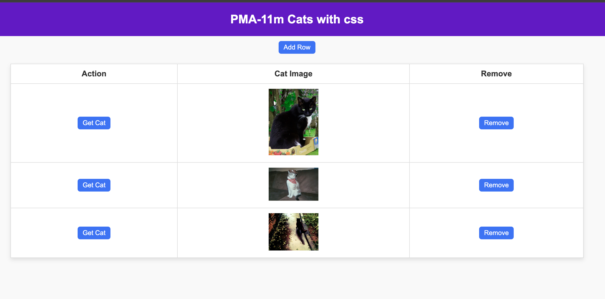
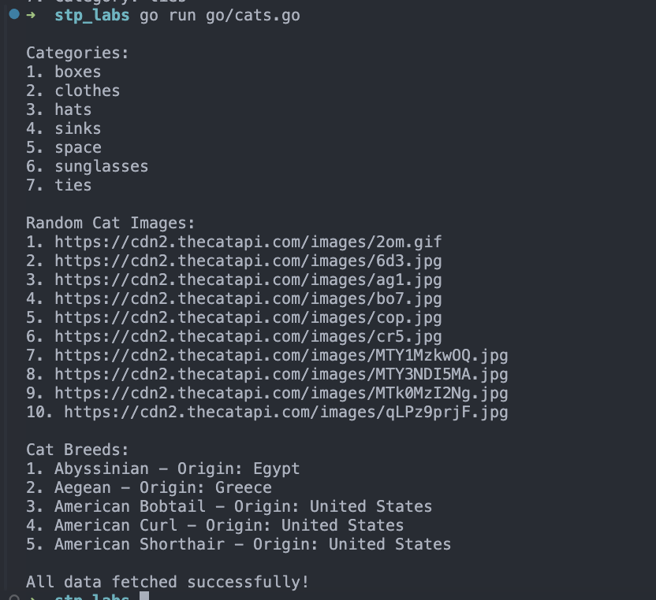
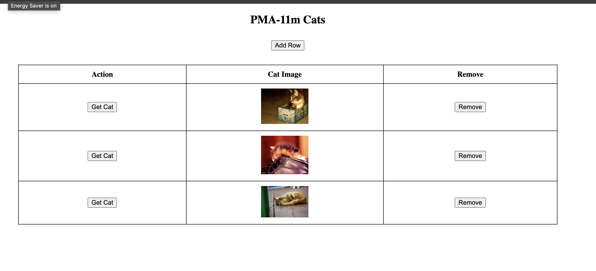
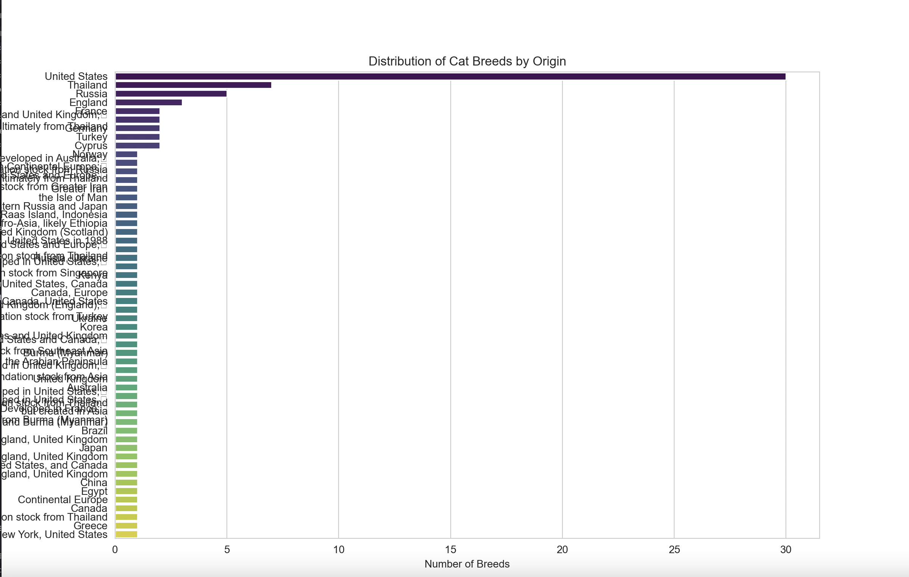
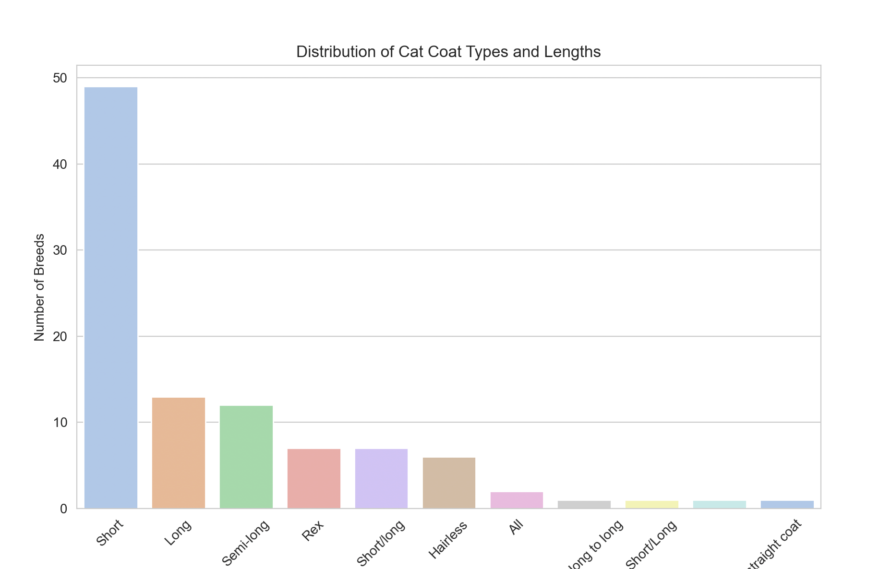
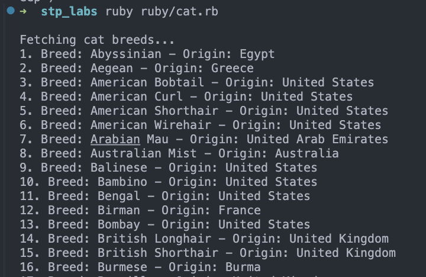

# СТП. Каїнський Дмитро

Цей проєкт містить колекцію прикладів і скриптів на різних мовах програмування, що демонструють практичні рішення, інструменти та концепції. Кожна паплка містить код на певній мові чи технології та демонструє їх фічі. В більшості старався використовувати тематику котів.

---

## 📂 Структура Проєкту

### 1. **css/**
   - Містить приклади, які демонструють можливості CSS, такі як анімації, макети та інтерактивність. За базу використав приклад для Javascript і додав трохи CSS.
   - **Зображення**:  
     

### 2. **go/**
   - Go скрипт, що демонструє інтеграцію API та конкурентне програмування з використанням goroutines.
   - **Зображення**:  
     

### 3. **javascript/**
   - JavaScript для інтерактивної розробки веб-додатків. В цьому прикладі робота з DOM елементами.
   - **Зображення**:  
     

### 4. **perl/**
   - Perl скрипт, що демонструє роботу з API та багатопоточність з використанням `threads`.

### 5. **python/**
   - Python скрипт для роботи з API та аналізу даних.
   - **Зображення**:  
     
   - **Зображення**:  
     

### 6. **ruby/**
   - Скрипт на Ruby, що використовує метапрограмування для роботи з API.
   - **Зображення**:  
     

### 7. **shell/**
   - Shell скрипт для автоматизації роботи розміщення файлів по типу. Використовую давно із cron джобами, щоб тримати порядок файлів.
---
